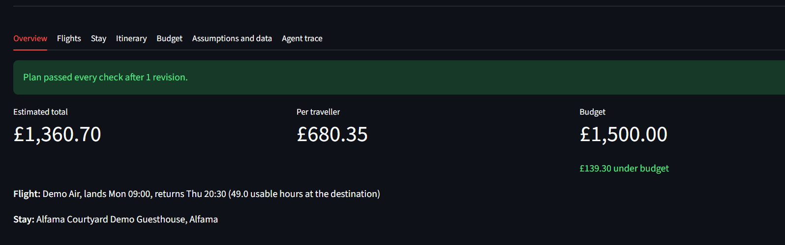
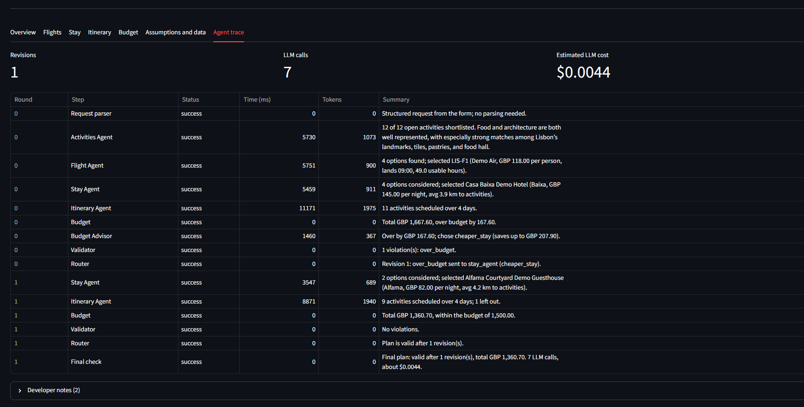
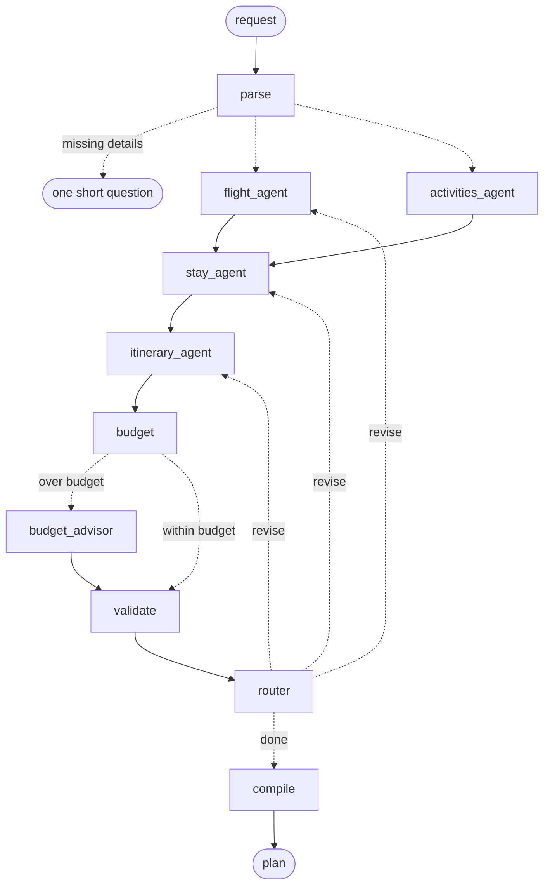

# Multi-Agent Travel Planner

A team of AI agents that plans a complete trip (flights, hotel, day-by-day itinerary and budget) and checks its own work before showing it to you. Built with LangGraph, OpenAI structured outputs and Streamlit.

**Live demo:** https://vijendra-travel-planner.streamlit.app/
**Tests:** 133, all runnable without API calls · **Evaluated** against a single-LLM-call baseline

> Demo data: airline and hotel names and all prices are fictional; place names are real. Trips depart from London to Lisbon or Barcelona. Nothing is booked.




## Results

Both systems were run on the same 8 test trips, 3 times each, with the same model (`gpt-5.6-luna`), the same data and the same deterministic scorer.

| | Single LLM call | Multi-agent system |
|---|---|---|
| Successful plans | 54% (13/24) | **100% (24/24)** |
| Plans breaking a hard rule | 46% | **0%** |
| Activities per plan | 5.4 | **6.0** |
| Median time per plan | **16.7 s** | 32.9 s |
| Cost per plan | **$0.0026** | $0.0048 |

**The finding:** a single call handles the *meaning* of the rules well (closed days, opening hours, interests, even recognising an impossible budget), but repeatedly gets the *arithmetic* wrong. All 11 of its failures were timing errors around flights, such as scheduling an activity inside the 90 minutes after landing. The multi-agent design never lets the LLM write a clock time, so it made no such errors, at about twice the latency and cost (still under half a cent per plan).

Full method and per-case results are in [Evaluation](#evaluation).

## How it works



The Flight and Activities agents run in parallel. Every plan is costed and validated; if it breaks a rule, the router sends work back to the agent responsible, up to 3 revisions, and only the affected steps rerun.

| Step | What it does | LLM or code |
|---|---|---|
| Parser | Turns free text into a structured request; asks one question if destination or dates are missing | LLM extracts fields; code does the date arithmetic and defaults |
| Flight Agent | Shortlists flights | Code computes cheapest, fastest and usable hours at the destination; the LLM picks the best value and explains the trade-offs |
| Activities Agent | Builds a pool of activities matching the traveller's interests | The LLM matches fuzzy interests ("wine" fits tapas); code removes closed places, sizes the pool and keeps free options |
| Stay Agent | Chooses a hotel | Code filters out hotels without late check-in for late flights and computes distances to activities; the LLM weighs price, location and rating |
| Itinerary Agent | Plans the days | The LLM assigns activities to days and slots; a deterministic scheduler sets every clock time, travel gap, meal and transfer |
| Budget | Costs the whole trip | Code |
| Budget Advisor | Chooses one fix when over budget | Code computes realistic savings; the LLM picks the fix that loses the least |
| Validator | Checks 13 kinds of problem | Code |
| Router | Decides what happens next | Code |

## Key design decisions

1. **The LLM makes decisions; code owns data and arithmetic.** Agents return IDs, labels and reasons, never prices or times. Code looks the IDs up in the real data, so the LLM cannot invent a flight, hotel or price, and an invented ID is caught immediately.
2. **The LLM never writes clock times.** It assigns activities to morning, afternoon or evening; the scheduler turns that into a timetable using opening hours, travel time, meals and flight buffers. This is the design choice the evaluation shows matters most.
3. **A validator and a revision loop, not a single pass.** Every plan is checked by deterministic rules. A routing table maps each problem to the agent that can fix it, the most upstream problem is fixed first, and rejected options are excluded from later rounds. Early testing showed that a plan can pass every rule and still be poor (a budget fix that removed 9 of 11 activities), so the validator also has a quality rule: every full day of the trip must include an activity.
4. **Every agent has a deterministic fallback.** If the LLM fails, times out or returns something invalid, the agent falls back to a simple, explainable rule. Each agent receives its LLM as a parameter, so the tests use a fake LLM with scripted answers: fast, free and repeatable, including deliberately bad answers.
5. **Honest data.** Every flight, hotel and activity carries a provenance label (`mock`, `estimate` or `live_api`), estimates come from documented rules, and the interface states what is demo data.

## Evaluation

**Method.** 8 test trips, each designed to test something specific: a standard trip, a tight budget, an impossible budget, a same-day trip, a budget traveller tempted by a cheap late flight, Monday closures, a group of five, and a free-text request. Each ran 3 times per system.

**The baseline** is one LLM call with the same model, the same data (every flight, hotel and activity with prices, hours and closures), the same rules in its instructions and the same budget estimates. Its plan is converted into the same data structures and scored by the same validator.

**Fairness notes**
- The baseline can answer "not feasible". It correctly did so on the impossible budget and this counts as a success, exactly like the multi-agent system reporting that the budget can't be met.
- Labelling slips that don't break a trip (for example free time labelled as an activity) are reported separately, not counted as hard violations.
- One test case was corrected after the first run: its budget turned out to be impossible for any plan, so it was raised from £600 to £700 to test what it was designed to test. The change applies equally to both systems.
- The baseline does not receive facts that the multi-agent system computes in code (usable hours per flight, distances, each day's usable window). Computing those facts is part of the design being evaluated.

**Successful runs per case**

| Case | Single LLM call | Multi-agent |
|---|---|---|
| Standard Lisbon trip | 2/3 | 3/3 |
| Tight Barcelona budget | 0/3 | 3/3 |
| Impossible budget | 3/3 | 3/3 |
| Same-day trip | 3/3 | 3/3 |
| Budget style, late-flight trap | 2/3 | 3/3 |
| Monday closures | 1/3 | 3/3 |
| Group of five | 1/3 | 3/3 |
| Free-text request | 1/3 | 3/3 |

The multi-agent system needed 1.2 revisions per plan on average, so the loop does real work. Raw per-run metrics are in [`evals/results/results.csv`](evals/results/results.csv).

**Caveat:** 3 repeats per case is a small sample. The direction of the result is clear, but the exact percentages would move with more runs.

## Running it

```bash
git clone https://github.com/vijendrapokharkar15-design/multi-agent-travel-planner.git
cd multi-agent-travel-planner
python -m venv .venv
.venv\Scripts\activate            # macOS/Linux: source .venv/bin/activate
pip install -r requirements-dev.txt
cp .env.example .env              # then add OPENAI_API_KEY and OPENAI_MODEL
```

| Task | Command |
|---|---|
| Web app | `streamlit run app.py` |
| One plan in the terminal | `python -m scripts.run_plan` |
| Tests (no API calls) | `pytest -q` |
| Full evaluation (about 5 minutes, under $0.20) | `python -m evals.run_evals` |
| Docker | `docker build -t travel-planner .` then `docker run --rm -p 8501:8501 --env-file .env travel-planner` |

## Project structure

```
agents/      the LLM-backed agents, the LLM wrapper and the fake LLM for tests
core/        deterministic code: budget, validator, scheduler, distances
graph/       the LangGraph workflow: code nodes, routing and wiring
providers/   data interfaces and the mock providers
schemas/     Pydantic models for travel data and the graph state
data/mock/   demo data for Lisbon and Barcelona
evals/       test cases, the single-call baseline, the runner and results
ui/          Streamlit rendering of the results
tests/       133 tests
app.py       the Streamlit app
```

## Limitations

- Demo data for two cities, departing from London only; prices, hours and closures are illustrative.
- Travel times use straight-line distances, so real journeys may take longer.
- Food, transport and contingency are estimates from fixed rules, in GBP only.
- A full plan takes about 30 seconds, mostly LLM time.
- The evaluation is small (24 runs per system) and measures rule-breaking, not how enjoyable a plan is.

## Next steps

- A real places API behind the existing activity provider interface, so activities work for any city without changing the agents.
- An ablation that gives the baseline the code-computed day windows, to measure how much of the gap they explain.
- Plan-quality scoring with an LLM judge or human ratings, alongside the rule checks.
- Letting the user choose the flight mid-run (a LangGraph interrupt).
- Tracing with a tool such as Langfuse.

## Tech stack

Python 3.12 · LangGraph · OpenAI structured outputs (Responses API) · Pydantic v2 · Streamlit · pytest · Docker · Streamlit Community Cloud